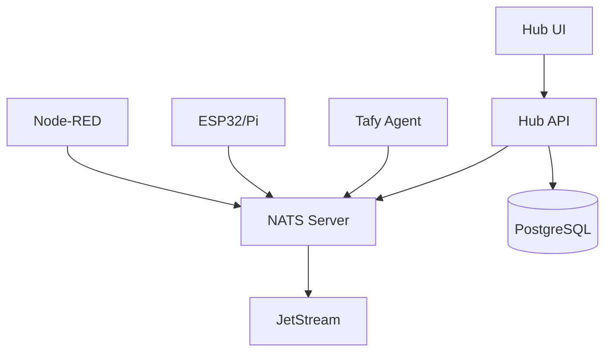

# Tafy Studio Developer Guide

Welcome to the Tafy Studio developer guide! This guide will help you contribute to Tafy Studio, develop custom drivers, create new flows, and extend the platform.

## Table of Contents

1. [Development Environment Setup](#development-environment-setup)
2. [Architecture Overview](#architecture-overview)
3. [Contributing Code](#contributing-code)
4. [Developing Drivers](#developing-drivers)
5. [Creating Node-RED Nodes](#creating-node-red-nodes)
6. [Working with HAL](#working-with-hal)
7. [Testing Guidelines](#testing-guidelines)
8. [Debugging Tips](#debugging-tips)
9. [Performance Considerations](#performance-considerations)
10. [Security Best Practices](#security-best-practices)

## Development Environment Setup

### Prerequisites

- **Node.js** 18+ and pnpm 8+
- **Python** 3.11+ with uv package manager
- **Go** 1.21+
- **Docker** and Docker Compose
- **k3d** or similar local Kubernetes
- **Git** with conventional commits

### Quick Start

1. **Clone the repository**

   ```bash
   git clone https://github.com/tafystudio/tafystudio.git
   cd tafystudio
   ```

2. **Install dependencies**

   ```bash
   # Install pnpm if not already installed
   curl -fsSL https://get.pnpm.io/install.sh | sh -
   # Or via npm:
   # npm install -g pnpm
   
   # Install all dependencies
   pnpm install
   
   # Install Python dependencies
   cd apps/hub-api
   uv pip install -e ".[dev]"
   cd ../..
   ```

3. **Start development environment**

   ```bash
   # Start all services
   pnpm run dev
   
   # Or start individual services
   cd apps/hub-ui && pnpm run dev    # Frontend
   cd apps/hub-api && uv run dev     # Backend
   cd apps/tafyd && go run . --debug # Agent
   ```

4. **Set up local Kubernetes**

   ```bash
   # Create k3d cluster
   k3d cluster create tafy-dev
   
   # Install NATS
   helm repo add nats https://nats-io.github.io/k8s/helm/charts/
   helm install nats nats/nats
   ```

### VS Code Setup

Install recommended extensions:

- ESLint
- Prettier
- Python
- Go
- Docker
- Kubernetes

Configure settings in `.vscode/settings.json`:

```json
{
  "editor.formatOnSave": true,
  "editor.codeActionsOnSave": {
    "source.fixAll.eslint": true
  },
  "python.linting.enabled": true,
  "python.linting.ruffEnabled": true
}
```

## Architecture Overview

### System Components



### Key Design Decisions

1. **NATS as Message Bus**: All communication uses NATS for pub/sub and request/reply
2. **HAL for Hardware**: Standardized messages for all hardware interactions
3. **Kubernetes Native**: Designed to run on k3s/k8s from the start
4. **Local-First**: Full functionality without internet connection
5. **Progressive Enhancement**: Works on constrained devices, scales to powerful ones

### Directory Structure

```text
tafystudio/
├── apps/               # Application packages
│   ├── hub-ui/        # Next.js frontend
│   ├── hub-api/       # FastAPI backend
│   └── tafyd/         # Go agent
├── packages/          # Shared packages
│   ├── hal-schemas/   # HAL message schemas
│   ├── sdk-ts/        # TypeScript SDK
│   └── sdk-python/    # Python SDK
├── drivers/           # Hardware drivers
├── firmware/          # MCU firmware
└── charts/            # Helm charts
```

## Contributing Code

### Git Workflow

1. **Fork and clone**

   ```bash
   git clone https://github.com/YOUR_USERNAME/tafystudio.git
   cd tafystudio
   git remote add upstream https://github.com/tafystudio/tafystudio.git
   ```

2. **Create feature branch**

   ```bash
   git checkout -b feature/your-feature-name
   ```

3. **Make changes and commit**

   ```bash
   # Stage changes
   git add .
   
   # Commit with conventional format
   git commit -m "feat: add new sensor driver"
   # or
   git commit -m "fix: resolve motor timeout issue"
   ```

4. **Push and create PR**

   ```bash
   git push origin feature/your-feature-name
   # Create PR on GitHub
   ```

### Commit Convention

Follow [Conventional Commits](https://www.conventionalcommits.org/):

- `feat:` New feature
- `fix:` Bug fix
- `docs:` Documentation only
- `style:` Code style changes
- `refactor:` Code refactoring
- `test:` Adding tests
- `chore:` Maintenance tasks

### Code Style

- **TypeScript/JavaScript**: ESLint + Prettier
- **Python**: Ruff + Black
- **Go**: gofmt + golangci-lint
- **General**: 2 spaces, no tabs (except Go)

Run formatting:

```bash
pnpm run format
pnpm run lint
```

## Developing Drivers

### Driver Architecture

Drivers translate between HAL messages and hardware-specific protocols.

```text
HAL Message → Driver → Hardware Protocol
              ↓
         Device Action
```

### Creating a New Driver

Use the Tafy CLI to scaffold:

```bash
tafy driver create \
  --name my-sensor \
  --type sensor \
  --language python \
  --capabilities "sensor.temperature:v1.0"
```

This creates:

```text
drivers/my-sensor/
├── Dockerfile
├── README.md
├── driver.yaml
├── pyproject.toml
├── src/
│   ├── __init__.py
│   ├── config.py
│   ├── driver.py
│   ├── hal.py
│   └── main.py
└── tests/
```

### Driver Implementation

1. **Configure capabilities** in `driver.yaml`:

   ```yaml
   name: my-sensor
   type: sensor
   capabilities:
     - sensor.temperature:v1.0
   config:
     sample_rate_hz: 10
     i2c_address: 0x48
   ```

2. **Implement driver logic**:

   ```python
   from tafy_sdk import Driver, HALMessage
   
   class MySensorDriver(Driver):
       async def setup(self):
           """Initialize hardware"""
           self.sensor = await self.connect_sensor()
       
       async def read_temperature(self):
           """Read and publish temperature"""
           temp = await self.sensor.read()
           
           msg = HALMessage(
               schema="sensor.temperature",
               payload={
                   "temperature_celsius": temp,
                   "unit": "celsius"
               }
           )
           
           await self.publish("hal.v1.sensor.temperature.data", msg)
   ```

3. **Handle commands**:

   ```python
   @driver.command("calibrate")
   async def handle_calibrate(self, msg):
       """Handle calibration command"""
       offset = msg.payload.get("offset", 0)
       await self.sensor.set_offset(offset)
       return {"status": "calibrated", "offset": offset}
   ```

### Testing Drivers

1. **Unit tests**:

   ```python
   def test_temperature_reading():
       driver = MySensorDriver()
       reading = driver.parse_temperature(b'\x19\x00')
       assert reading == 25.0
   ```

2. **Integration tests**:

   ```python
   async def test_hal_message_publish():
       driver = MySensorDriver()
       await driver.setup()
       
       messages = []
       await driver.publish_temperature()
       
       assert len(messages) == 1
       assert messages[0].schema == "sensor.temperature"
   ```

3. **Hardware-in-loop tests**:

   ```bash
   # With actual hardware connected
   tafy driver test my-sensor --hardware
   ```

## Creating Node-RED Nodes

### Node Structure

Custom nodes for Tafy Studio follow Node-RED conventions:

```javascript
module.exports = function(RED) {
    function TafyMotorNode(config) {
        RED.nodes.createNode(this, config);
        
        const nats = RED.nodes.getNode(config.server);
        
        this.on('input', async (msg) => {
            // Process message
            const command = {
                linear_velocity: msg.payload.linear || 0,
                angular_velocity: msg.payload.angular || 0
            };
            
            // Publish to NATS
            await nats.publish('hal.v1.motor.cmd', command);
            
            this.send(msg);
        });
    }
    
    RED.nodes.registerType("tafy-motor", TafyMotorNode);
};
```

### Node Registration

1. Create `package.json`:

   ```json
   {
     "name": "node-red-contrib-tafy-motor",
     "node-red": {
       "nodes": {
         "tafy-motor": "tafy-motor.js"
       }
     }
   }
   ```

2. Add HTML definition:

   ```html
   <script type="text/x-red" data-template-name="tafy-motor">
       <div class="form-row">
           <label for="node-input-device">Device</label>
           <input type="text" id="node-input-device">
       </div>
   </script>
   ```

### Publishing Nodes

```bash
npm publish --access public
```

## Working with HAL

### Message Structure

Every HAL message follows the envelope format:

```typescript
interface HALEnvelope {
  hal_major: number;
  hal_minor: number;
  schema: string;
  device_id: string;
  caps: string[];
  ts: string;
  payload: any;
}
```

### Publishing Messages

```typescript
// TypeScript
import { HALMessage } from '@tafy/sdk-ts';

const msg = new HALMessage({
  schema: 'motor.differential.command',
  payload: {
    linear_vel_m_per_s: 0.5,
    angular_vel_rad_per_s: 0.0
  }
});

await nats.publish('hal.v1.motor.cmd', msg);
```

```python
# Python
from tafy_sdk import HALMessage

msg = HALMessage(
    schema="motor.differential.command",
    payload={
        "linear_vel_m_per_s": 0.5,
        "angular_vel_rad_per_s": 0.0
    }
)

await nc.publish("hal.v1.motor.cmd", msg.to_json())
```

### Subscribing to Messages

```go
// Go
sub, _ := nc.Subscribe("hal.v1.sensor.*.data", func(msg *nats.Msg) {
    var hal HALMessage
    json.Unmarshal(msg.Data, &hal)
    
    switch hal.Schema {
    case "sensor.range":
        handleRangeSensor(hal.Payload)
    case "sensor.imu":
        handleIMU(hal.Payload)
    }
})
```

## Testing Guidelines

### Test Levels

1. **Unit Tests**: Test individual functions/methods
2. **Integration Tests**: Test component interactions
3. **E2E Tests**: Test complete user workflows
4. **HIL Tests**: Test with real hardware

### Running Tests

```bash
# All tests
pnpm test

# Specific package
cd apps/hub-ui && pnpm test

# Watch mode
pnpm test:watch

# Coverage
pnpm test:coverage
```

### Writing Good Tests

```typescript
describe('MotorController', () => {
  it('should convert velocity to PWM correctly', () => {
    const pwm = velocityToPWM(0.5); // 0.5 m/s
    expect(pwm).toBe(128); // 50% duty cycle
  });

  it('should handle stop command', async () => {
    const controller = new MotorController();
    await controller.stop();
    
    expect(controller.leftPWM).toBe(0);
    expect(controller.rightPWM).toBe(0);
  });
});
```

## Debugging Tips

### Frontend Debugging

1. **Browser DevTools**: Use React DevTools
2. **Network tab**: Monitor WebSocket messages
3. **Redux DevTools**: Track state changes

### Backend Debugging

1. **FastAPI Interactive Docs**: <http://localhost:8000/docs>
2. **Logging**:

   ```python
   import structlog
   logger = structlog.get_logger()
   
   logger.info("device_connected", device_id=device.id)
   ```

3. **NATS CLI**:

   ```bash
   # Subscribe to all HAL messages
   nats sub "hal.v1.>"
   
   # Request device info
   nats req device.info.get '{"device_id": "esp32-123"}'
   ```

### Firmware Debugging

1. **Serial Monitor**:

   ```bash
   pio device monitor -b 115200
   ```

2. **Debug flags** in `config.h`:

   ```c
   #define DEBUG_MOTOR 1
   #define DEBUG_NETWORK 1
   ```

## Performance Considerations

### Message Rate Limiting

```python
# Limit sensor publishing rate
@rate_limit(max_per_second=100)
async def publish_sensor_data(self, data):
    await self.nats.publish("sensor.data", data)
```

### Batch Operations

```typescript
// Batch multiple commands
const commands = devices.map(d => ({
  subject: `device.${d.id}.cmd`,
  payload: { action: 'reset' }
}));

await nats.batchPublish(commands);
```

### Resource Monitoring

```go
// Monitor goroutines
go func() {
    for {
        log.Printf("Goroutines: %d", runtime.NumGoroutine())
        time.Sleep(10 * time.Second)
    }
}()
```

## Security Best Practices

### Input Validation

```python
from pydantic import BaseModel, validator

class MotorCommand(BaseModel):
    linear_velocity: float
    angular_velocity: float
    
    @validator('linear_velocity')
    def validate_linear(cls, v):
        if abs(v) > 2.0:  # Max 2 m/s
            raise ValueError('Linear velocity too high')
        return v
```

### Authentication

```typescript
// Verify device tokens
const verifyDevice = async (token: string): Promise<Device> => {
  const decoded = jwt.verify(token, process.env.JWT_SECRET);
  return await deviceService.findById(decoded.deviceId);
};
```

### Rate Limiting

```python
from fastapi import HTTPException
from slowapi import Limiter

limiter = Limiter(key_func=get_remote_address)

@app.post("/api/v1/commands")
@limiter.limit("10/minute")
async def send_command(cmd: Command):
    # Process command
    pass
```

### Secure Communication

1. **TLS for NATS**:

   ```yaml
   nats:
     tls:
       secret:
         name: nats-client-tls
   ```

2. **mTLS for services**:

   ```go
   tlsConfig := &tls.Config{
       Certificates: []tls.Certificate{cert},
       RootCAs:      caCertPool,
   }
   ```

## Common Patterns

### Request-Reply Pattern

```python
# Request device info
async def get_device_info(device_id: str):
    response = await nc.request(
        f"device.{device_id}.info",
        b"{}",
        timeout=2.0
    )
    return json.loads(response.data)
```

### Event Sourcing

```typescript
// Store all commands for replay
interface CommandEvent {
  timestamp: Date;
  deviceId: string;
  command: any;
  result: 'success' | 'failure';
}

await eventStore.append('commands', commandEvent);
```

### Circuit Breaker

```python
from circuitbreaker import circuit

@circuit(failure_threshold=5, recovery_timeout=60)
async def call_device(device_id: str, command: dict):
    return await device_service.send_command(device_id, command)
```

## Troubleshooting

### Common Issues

1. **NATS Connection Failed**
   - Check if NATS is running: `kubectl get pods -n default`
   - Verify credentials: `echo $NATS_URL`

2. **Device Not Discovered**
   - Check mDNS: `dns-sd -B _tafy._tcp`
   - Verify network: Same subnet/VLAN?

3. **WebSerial Not Working**
   - Use HTTPS or localhost
   - Check browser compatibility

### Debug Commands

```bash
# Check service health
curl http://localhost:8000/api/v1/system/health

# View NATS streams
nats stream ls

# Check k3s cluster
kubectl get nodes
kubectl get pods --all-namespaces

# View container logs
docker logs tafy-hub-api
kubectl logs -f deployment/hub-api
```

## Resources

- [Architecture Documentation](./ARCHITECTURE.md)
- [HAL Specification](./HAL_SPEC.md)
- [API Reference](./API_REFERENCE.md)
- [Testing Guide](./TESTING.md)
- [Security Policy](./SECURITY.md)

## Getting Help

- **Discord**: [discord.gg/tafy](https://discord.gg/tafy)
- **GitHub Issues**: [github.com/tafystudio/tafystudio/issues](https://github.com/tafystudio/tafystudio/issues)
- **Documentation**: [docs.tafy.studio](https://docs.tafy.studio)

Happy coding! 🚀
